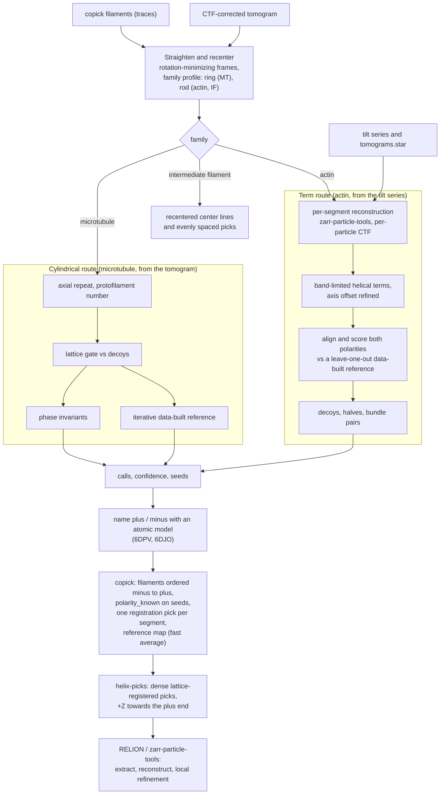

# copick-helix

Fast, data-driven polarity, lattice and in-plane orientation of traced filaments (microtubules, actin; intermediate
filaments are recentered only) in cryo-electron tomograms, for copick projects. No subtomogram refinement: each
filament's own helical Fourier signal, restricted to where its structure puts signal, measured only where the tilt
series sampled it.

## How it works

Each traced filament is straightened along its trace and recentered on its density. Its helical signal is then
measured only where the family's helical selection rule puts it (the layer lines and the Bessel orders allowed on each),
and only where the tilt series sampled Fourier space. Two quantities come out of it:
- **polarity:** relative, by comparing filaments with each other and with a reference built from the data. An atomic
  model only names which group is plus.
- **registration:** each segment's rotation about and shift along the axis on the lattice.

Every call is tested against phase-scrambled decoys, which keep the power spectrum but have no helical order; only
filaments that beat the decoys and are confident become seeds (`polarity_known`). The results go back into copick as
filaments and oriented, lattice-registered picks, ready for a refinement that starts with local searches.



## Install

```bash
pip install -e .        # branch main: copick 1.x; branch v2.0: copick 2
```

gemmi (atomic models, used to name which polarity group is 'plus') and zarr-particle-tools (local CTF-corrected
reconstructions from tilt series) are regular dependencies.

## Use

```bash
copick process helix-polarity -c config.json \
    -i "microtubule:baseline/v1" -t "wbp-filtered@10.0" \
    --family microtubule --tilt-range -45 63 \
    --work-dir helix_out/ -o "microtubule:helix/1"

copick process helix-picks -c config.json -i "microtubule:helix/1" -o "microtubule:helix-picks/1" --every 1

# actin: segments reconstructed from the tilt series (zarr-particle-tools), term route
copick process helix-polarity -c config.json \
    -i "actin:traces/1" -t "wbp-filtered@10.0" --family actin --tilt-range -45 63 \
    --source tiltseries --tomograms-star relion_project/Import/job001/tomograms.star --bin 3 --workers 8 \
    --work-dir helix_actin/ -o "actin:helix/1"

# intermediate filaments: recentering only (no lattice or polarity)
copick process helix-recenter -c config.json \
    -i "intermediate-filament:baseline/v1" -t "wbp-filtered@10.0" --family intermediate_filament \
    --tilt-range -45 63 --work-dir helix_if/ -o "intermediate-filament:recentered/1" \
    --picks "intermediate-filament:recentered/1" --spacing 85
```

`helix-recenter` recenters each trace on its density (the family's cross-section profile) and writes the recentered
center lines as filaments, with no lattice or polarity analysis. With `--picks`, it also writes evenly spaced picks
oriented along the line: +Z follows the trace direction, which is not a polarity, and the rotation about the axis is
arbitrary but continuous.

`helix-polarity` straightens and recenters each filament and measures its helical parameters. It runs both polarity
methods and registers every segment to a reference built from the data. With `-o object:user/session` it writes:

- **filaments**: the recentered center lines as Catmull-Rom curves, visible in every copick viewer. Each is ordered
  minus -> plus when the polarity is known, and carries `polarity_known` for seeds (confident in both methods,
  methods agreeing, lattice detected). The calls, confidences, helical parameters and lattice gate go under
  `metadata["copick_helix"]`.
- **picks** (same name): one registration per segment, placed at a lattice point. The full transform maps a reference
  frame with +Z towards the plus end onto the tomogram; `instance_id` is the filament ID.

In WORK_DIR it writes:
- `calls.tsv` and `summary.json`;
- `reference_<family>.mrc`, the fast average of the registration particles in the same frame (an initial model);
- with `--keep-volumes`, the straightened volumes.

`helix-picks` samples every n-th lattice point along each filament from those stored results, with no recomputation.
Every particle sits on the same lattice position and in the same frame, so a refinement can start from local
searches. `helix-polarity --picks URI --every n` writes the same dense picks directly from the analysis.

`--family`: `microtubule` (13_3), `microtubule_N_S`, `actin` (6DJO; plus = barbed end), `intermediate_filament`
(vimentin, 8RVE; recentering only, since no IF lattice was detectable in cellular data. `helix-polarity` with it runs
`helix-recenter`.) Use CTF-corrected tomograms for microtubules: the polarity signal sits at
20-40 A, where the first CTF zero usually lies.

**Actin** (and any family with an atomic model, via `--route terms`) uses the term route. A deconvolved 10 A tomogram
cannot follow the depth-dependent defocus of a 7 nm filament, so `--source tiltseries` reconstructs every 760 A
segment on its own from the tilt series (zarr-particle-tools, per-particle defocus, Wiener CTF correction; cached in
WORK_DIR/segments). It needs a RELION `tomograms.star` and the directory its tilt-series paths are relative to
(`--tiltseries-dir`, by default the project directory of an `Import/jobNNN/tomograms.star`). The term route also writes
`segments.tsv` (per-segment registration and score) and `decoy_calls.tsv` (the same analysis on phase-scrambled
segments). `polarity_known` is set only where polarity is detected over the decoys and the filament is confident.

## Methods

1. **Straightening and recentering.** Rotation-minimizing frames along the trace. Windows of the cross-section are
   matched to the family's radial profile (a ring for microtubules) inside the measured Fourier directions.
2. **Per-filament parameters.** The microtubule monomer repeat comes from the 4 nm layer line; the protofilament
   number from the equator.
3. **Phase invariants** (`copick_helix.invariants`). A least-squares fit of the Bessel orders the family's helical
   selection rule allows, on its layer lines, using only measured Fourier samples. From that fit come quantities that
   ignore rotation and shift but turn into their complex conjugate under a polarity flip. A filament x filament
   comparison splits all filaments into two polarity groups.
4. **Iterative data-built reference** (`copick_helix.iterative`). A 2-parameter alignment (rotation about, shift
   along the axis) plus a per-filament polarity, averaged into a reference built from the data. It is restricted
   to the family's Fourier support and converges from random starts.
5. **Labels.** An atomic model (6DPV for microtubules) passed through the same steps names which group is plus. It
   is optional; relative polarity needs no model.
6. **Term route** (`copick_helix.bands`, actin). Per segment, the coefficients of the family's strongest helical terms
   on their exact layer-line planes. Each term is measured only in the in-plane band it was selected for (from the
   atomic model on the data's grid, counting only terms the segment length resolves). The axis offset is refined
   per segment on the 300-40 A band. The dataset's axial scale is fitted from the low-band layer lines. A data-built,
   leave-one-filament-out reference from random polarity starts aligns every segment (rotation, shift over one rise)
   and calls each filament. The halves, z scores and bundle-pair agreement are compared against the same pipeline on
   phase-scrambled decoys; polarity counts as detected only when the data beat the decoys in halves agreement or in
   the number of confident filaments. On the
   tilt-series segments of CryoET Data Portal dataset 10521 (182 actin filaments) the halves agree for 105/135 filaments against 60/135
   for decoys, and side-by-side bundle neighbors share polarity in 147/177 pairs against 93/177.

## Dependencies

copick (1.x on `main`, 2.x on `v2.0`), zarr-particle-tools and gemmi. zarr-particle-tools depends on copick core
but not on copick-utils, and neither copick nor copick-utils depends on this package, so there is no cycle. The
commands enter the copick CLI through the `copick.process.commands` entry point.

See `PLAN.md` for the design, the filament families and the status.
